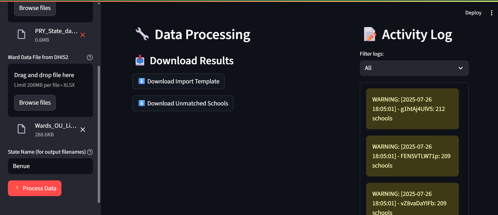
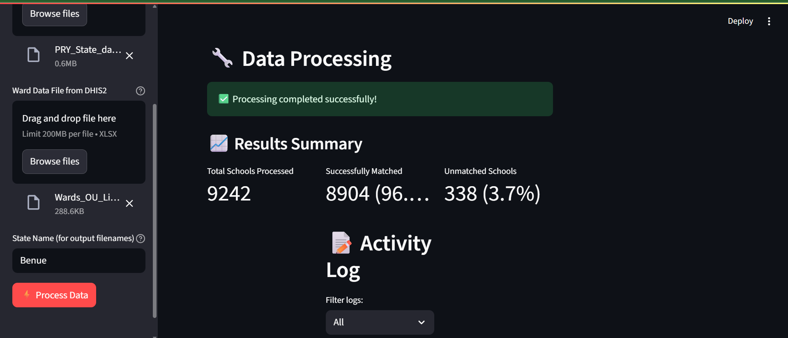

# Orgunits_Import_Template_Generator Tool for DHIS2


A robust matching system that connects schools to their appropriate administrative wards and generates DHIS2-compatible import templates with automatically generated UIDs.

## 🌟 Key Features

- **Automated Matching**: Advanced fuzzy matching algorithm connects schools to wards
- **DHIS2 Compliance**: Generates properly formatted import templates
- **UID Generation**: Creates valid 11-character DHIS2 UIDs for all schools
- **Interactive Dashboard**: Real-time progress tracking and metrics
- **Comprehensive Reporting**: Provides matching statistics and unmatched records

## 📸 Screenshots


*Main processing interface with progress tracking*


*Results summary with metrics and visualizations*

## 🚀 Quick Start

### Prerequisites
- Python 3.8+
- pip package manager

### Installation
```bash
# Clone the repository
git clone https://github.com/yourusername/school-ward-matcher.git
cd school-ward-matcher

# Create and activate virtual environment
python -m venv venv
source venv/bin/activate  # On Windows use `venv\Scripts\activate`

# Install dependencies
pip install -r requirements.txt

# Running the application
streamlit run school_ward_app.py
- The application will open in your default browser at http://localhost:8501

### 📂 File Structure
Orgunits-Import-Template-Generator/
├── School_Import_Template_Generator.py       # Main application code
├── requirements.txt         # Python dependencies
├── README.md                # This documentation
├── school_matching.log      # Generated log file
├── assets/                  # Screenshots and images
│   ├── app-screenshot.png
│   └── results-view.png
└── sample_data/             # Example files
    ├── sample_schools.xlsx
    └── sample_wards.xlsx
    
    

